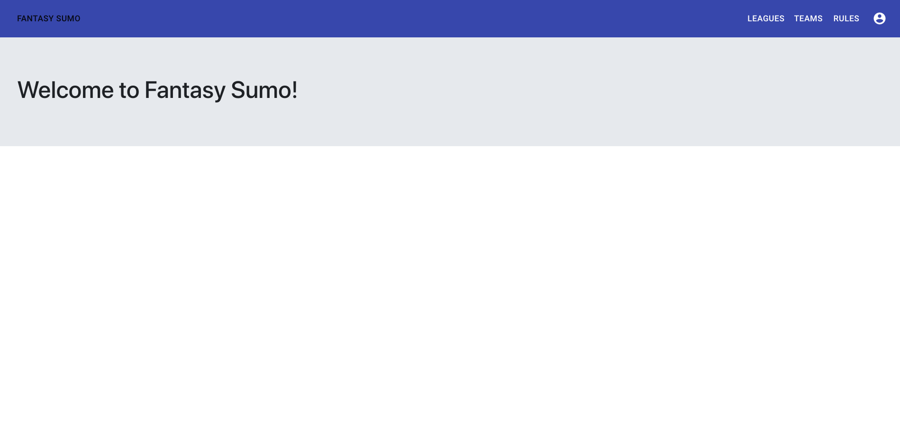
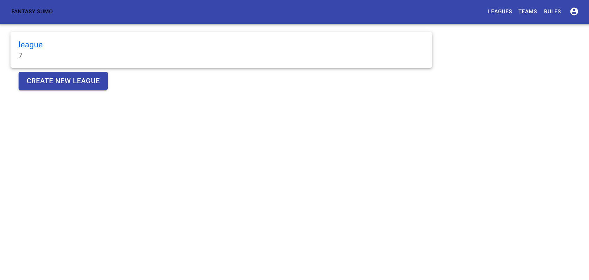
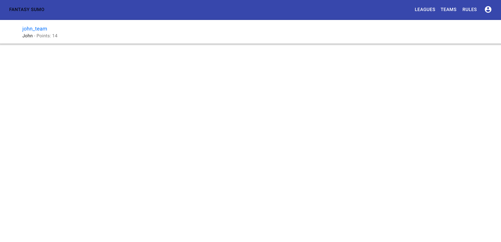

# Fantasy Sumo - Frontend

Fantasy Sumo is a fantasy sports app for fans of Sumo Wrestling. Users can create leagues with other users, draft teams of sumo wrestlers, and compete for the most points.

[This](https://github.com/johnrusch/fantasy-sumo-backend) is a link to the back-end repository.

## Motivation

After playing "Fantasy Sumo" with friends only using an excel spreadsheet, I wanted to create an app that makes the experience automatic and user friendly. 

## Screenshots
Login

Home Page

User Leagues Page

User Teams Page

## Technology Used

- React
- Redux
- Nokogiri
- Rails Router

## Features

Users Can:
- Create an account
- Create a league
- Create a team
- View league standings
- View wrestler stats

## Contributing

Contributions are welcome, submit a pull request!

## Author

* **John Rusch** - [GitHub](https://github.com/johnrusch)

## License

This project is licensed under the [GNU GPL](https://www.gnu.org/licenses/gpl-3.0.en.html)
